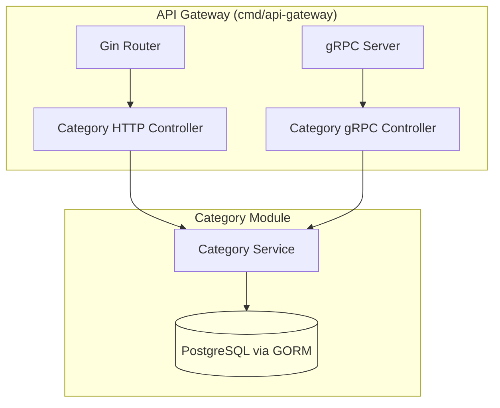

# IKV – Inkventory Service

> **Inkventory** là pet‑project Go theo kiểu **Modular Monolith** nhưng tuân thủ structure bạn yêu cầu: `modules/<name>/infras/controller/...`, *không* đổi sang api/core/adapter.
> Database mặc định **PostgreSQL 16** sử dụng **GORM**.

---

## 🎯 Mục tiêu

* Thực hành Go với kiến trúc tách tầng rõ ràng nhưng quen thuộc: **model → service → infras**.
* Dễ tách 1 module thành micro‑service khi cần (giữ `controller` & `repository` sẵn).
* Tài liệu 100 % tiếng Việt, chỉ chừa thuật ngữ bắt buộc.

---

## 🏗️ Cấu trúc thư mục tổng quát

```text
ikv/
├── go.work                      # gom sub‑module Go
├── build/                       # Dockerfile, script CI
├── docker-compose.yml           # Postgres, NATS, Jaeger, Adminer, ikv
├── shared/                      # logger, config, errors, eventbus
│   └── go.mod
├── modules/
│   ├── category/                # ví dụ module cụ thể (ảnh bạn gửi)
│   │   ├── module.go            # function NewModule() đăng ký DI
│   │   ├── model/               # entity + DTO + error
│   │   │   ├── category.go
│   │   │   ├── dto.go
│   │   │   └── error.go
│   │   ├── service/             # business logic
│   │   │   ├── service.go
│   │   │   ├── create_new_category.go
│   │   │   ├── update_category_by_id.go
│   │   │   └── ...
│   │   └── infras/
│   │       ├── repository/      # implement bằng GORM (PostgreSQL)
│   │       │   └── category_repo_gorm.go
│   │       └── controller/      # cổng giao tiếp
│   │           ├── http-gin/    # REST handler
│   │           │   └── handler_category.go
│   │           └── grpcctl/     # gRPC server & client stub
│   │               ├── category.proto
│   │               └── server.go
│   ├── inventory/               # module quản lý kho (tự xây tương tự)
│   ├── ordering/
│   ├── customer/
│   └── pricing/
├── cmd/
│   ├── api-gateway/             # tập hợp route HTTP, gRPC gateway, DI
│   ├── worker/                  # chạy background job
│   └── migrate/                 # golang‑migrate runner
└── README.md
```

> **Key point:**
> *`controller`* = cổng (HTTP/gRPC), *`repository`* = adapter dữ liệu. Tất cả nằm trong `infras` để tách khỏi business.

---

## 🔄 Luồng phụ thuộc

```
 model  ←── service  ←── repository (infras)  → PostgreSQL
                        ↑
                      controller (HTTP / gRPC)
```

* Model & Service **không** import `Gin`, `GORM`.
* Service chỉ depends vào **interface** `CategoryRepository` đặt trong `service` (hoặc `model`).
* `repository/category_repo_gorm.go` implements interface, dùng GORM Postgres.

---

## 🔍 Sơ đồ tổng thể (Mermaid)



---

## 📅 Lộ trình triển khai

| Sprint | Mục tiêu                           | Việc cần làm                                                                      |
| ------ | ---------------------------------- | --------------------------------------------------------------------------------- |
| **0**  | Bootstrapping                      | `go.work init`; tạo `shared`, cấu hình Postgres trong docker‑compose; viết `.env` |
| **1**  | Category MVP                       | Schema `categories`; repo GORM; service CRUD; HTTP `GET /v1/categories`           |
| **2**  | Inventory                          | mô hình `books`, validate stock; controller HTTP + repo                           |
| **3**  | Ordering                           | TX giảm stock; publish event qua `shared/eventbus`                                |
| **4**  | Observability & CI                 | Jaeger, Prometheus, GitLab CI chạy `go test`, lint, build image                   |
| **5**  | Xuất Inventory thành micro‑service | tạo repo mới, copy module, đổi DI trong gateway thành client gRPC                 |

---

## ⚙️ Cấu hình Postgres + GORM

```yaml
db:
  image: postgres:16-alpine
  environment:
    POSTGRES_USER: ikv
    POSTGRES_PASSWORD: ikv123
    POSTGRES_DB: ikv
  ports: ["5432:5432"]
  volumes:
    - pgdata:/var/lib/postgresql/data
```

```env
DB_DSN=postgres://ikv:ikv123@db:5432/ikv?sslmode=disable
```

Trong code:

```go
import (
    "gorm.io/driver/postgres"
    "gorm.io/gorm"
)

db, err := gorm.Open(postgres.Open(cfg.DB_DSN), &gorm.Config{})
```

---

## 🔧 Chạy dev

```bash
cp env.example .env
make dev            # docker-compose up -d db nats jaeger

# gateway
cd cmd/api-gateway
go run .
```

Migration SQL tự động (cmd/migrate).

---

## 🧪 Kiểm thử

```bash
go test ./...
```

* Unit: mock `CategoryRepository` bằng `testify/mock`.
* Integration: docker‑compose, gọi HTTP.

---

## 🤝 Quy trình đóng góp

1. Nhánh `feat/XYZ` ↔ Git flow.
2. `make test lint` bắt buộc pass.
3. PR: đảm bảo module chỉ import `infras/controller` & `infras/repository` trong **chính nó** – không cross import.

---

## 📄 License

MIT

---

> **Inkventory – quản lý kho sách, gọn nhẹ và có thể tách dịch vụ bất cứ lúc nào.**
